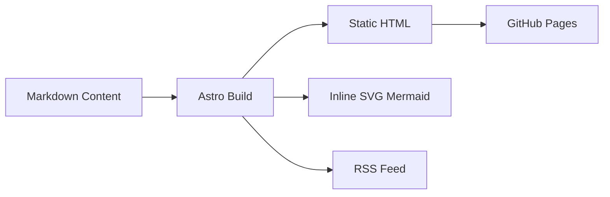
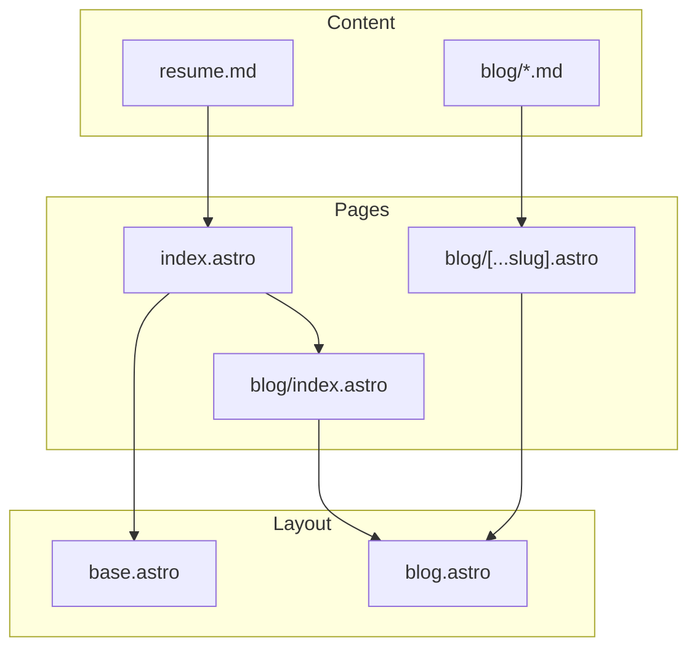

## Why Astro?

This site used to be a hand-rolled markdown-to-HTML pipeline: `marked` parser + EJS template + custom CSS. It worked, but adding a blog meant reinventing pagination, RSS, tag pages, and image optimization.

Astro gives all of that out of the box, with zero client JavaScript.

## Architecture

Here's the build pipeline:



The `rehype-mermaid` plugin converts ` ```mermaid ` code blocks to inline SVG during the build. No browser, no JavaScript, no runtime cost.

## Component Structure



## What's Next

- More blog posts on engineering leadership and architecture
- Tag pages and RSS feed
- Dark mode support
- Further performance optimization

Stay tuned!
